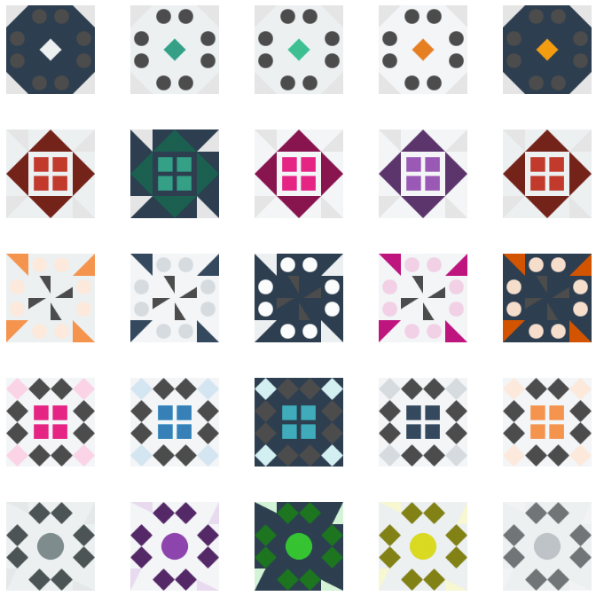

# [Jdenticon](https://github.com/dmester/jdenticon) - customized
JavaScript library for generating highly recognizable identicons using HTML5 canvas or SVG.

This fork enables you to (optionally) pass a mainColor which is then lightened/darkened to create an identicon. 

We're using PimpTrizkit`s gorgeous [Shade Blend and Convert](https://github.com/PimpTrizkit/PJs/wiki/12.-Shade,-Blend-and-Convert-a-Web-Color-(pSBC.js)) funtion to blend the mainColor. Since it's GPL licensed we had to adapt this license accordingly.



## Getting started
Using Jdenticon is simple. Follow the steps below to integrate Jdenticon into your website.

### 1. Add identicon placeholders
Jdenticon is able to render both raster and vector identicons. Raster icons are rendered 
slightly faster than vector icons, but vector icons scale better on high resolution screens.
Add a canvas to render a raster icon, or an inline svg element to render a vector icon.

```HTML
<!-- Vector icon -->
<svg width="80" height="80" data-jdenticon-value="icon value"></svg>

<!-- OR -->

<!-- Raster icon -->
<canvas width="80" height="80" data-jdenticon-value="icon value"></canvas>
```

### 2. Add reference to Jdenticon
Include the Jdenticon library somewhere on your page. You can either host it yourself or 
use it right off [jsDelivr](https://www.jsdelivr.com).

```HTML
<script type="text/javascript" src="-path-to-/jdenticon.min.js"></script>
```
That's it!

### 3. Customize your config

The mainColor config option enables you to pass a color which is used for themeing (by lightening/darkening the mainColor in relation to your lightness settings).

**Basic**
```JS
  jdenticon.config = {
    lightness: {
      color: [0.4, 0.8],
      grayscale: [0.3, 0.9],
    },
    saturation: 0.5,
    mainColor: "#00bf93",
    backColor: "#00000000" // transparent
  }
```

**Advanced / Think out of the box**
```JS
  const palette = {
    color1: '#00bf93',
    color2: '#16a086',
    color3: '#2dcc70',
  }
  const backgroundPalette = {
    bgColor1: '#2d3e50',
    bgColor2: '#f3f5f7',
    bgColor3: '#ecf0f1',
  }
  
  jdenticon.config = {
    lightness: {
      color: [0.4, 0.8],
      grayscale: [0.3, 0.9],
    },
    saturation: 0.5,
    mainColor:
      palette[
        Object.keys(palette)[
          Math.floor(Math.random() * Object.keys(palette).length)
        ]
      ],
    backColor:
      backgroundPalette[
        Object.keys(backgroundPalette)[
          Math.floor(Math.random() * Object.keys(backgroundPalette).length)
        ]
      ],
  }
```

Make sure to check the Jdenticon API config options in detail....

## Other resources
### API documentation
For more usage examples and API documentation, please see:

https://jdenticon.com

## License
Since we're using using PimpTrizkit`s gorgeous [Shade Blend and Convert](https://github.com/PimpTrizkit/PJs/wiki/12.-Shade,-Blend-and-Convert-a-Web-Color-(pSBC.js)) funtion to blend the mainColor we had to adapt the license to GPL. 
